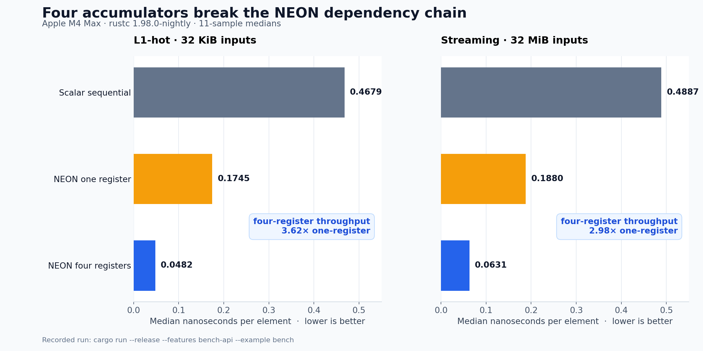

# Apple M4 accumulator benchmark

This study compares the sequential scalar reference, one NEON accumulator, and Centaur's four-accumulator NEON kernel on an Apple M4 Max. Each number is the median of 11 calibrated samples; lower is better.



<!-- benchmark-data:start -->
| Fixture | Variant | Median ns/element | Relative to scalar |
| --- | --- | ---: | ---: |
| L1-hot, 32 KiB inputs | Scalar sequential | 0.4679 | 1.00× |
| L1-hot, 32 KiB inputs | NEON, one register | 0.1745 | 2.68× |
| L1-hot, 32 KiB inputs | NEON, four registers | 0.0482 | 9.71× |
| Streaming, 32 MiB inputs | Scalar sequential | 0.4887 | 1.00× |
| Streaming, 32 MiB inputs | NEON, one register | 0.1880 | 2.60× |
| Streaming, 32 MiB inputs | NEON, four registers | 0.0631 | 7.74× |
<!-- benchmark-data:end -->

In the recorded run, four NEON accumulators delivered 3.62× the throughput of one accumulator for the L1-hot fixture and 2.98× for the streaming fixture. Across four complete runs, those ratios ranged from 3.61× to 3.62× and from 2.98× to 3.08× respectively. These are measurements from this machine, not general performance guarantees.

Release assembly shows that LLVM forms the sequential reference's products with packed `fmul.4s` instructions, extracts their lanes, and preserves one scalar `fadd` accumulation chain in slice order. The one-register NEON control has one loop-carried `fmla.4s` chain; the production kernel has four independent `fmla.4s` chains.

Run the benchmark with:

```bash
cargo run --release --features bench-api --example bench
```

The `bench-api` feature is measurement scaffolding and is not supported application API.

Regenerate the graph with Matplotlib:

```bash
python3 tools/plot_m4_benchmark.py
```
